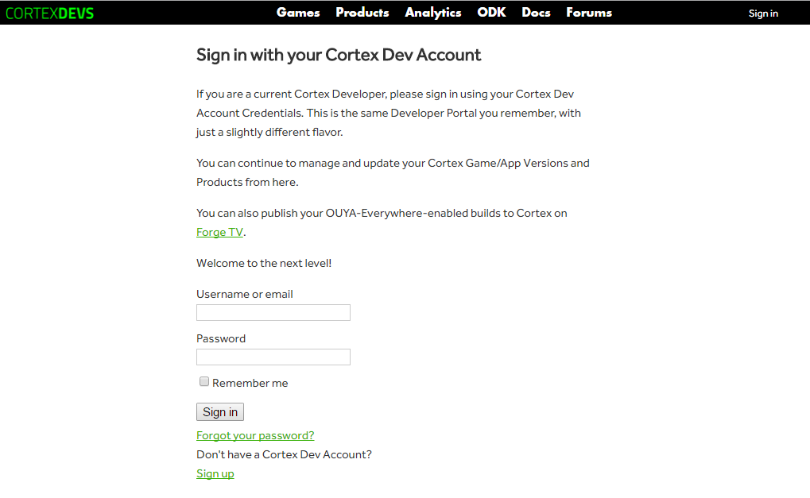
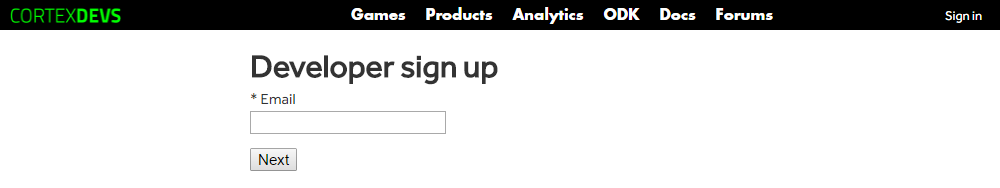
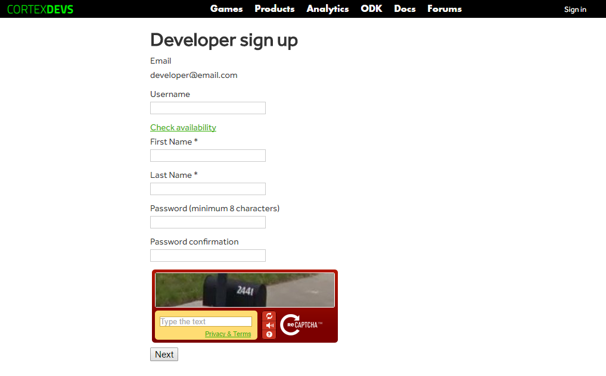
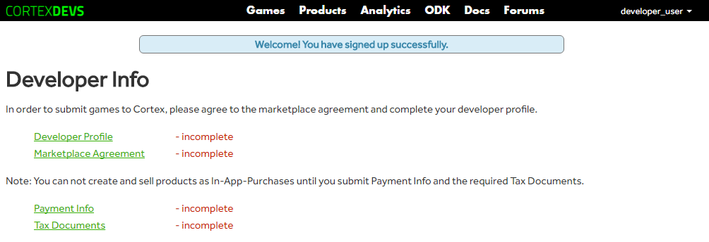
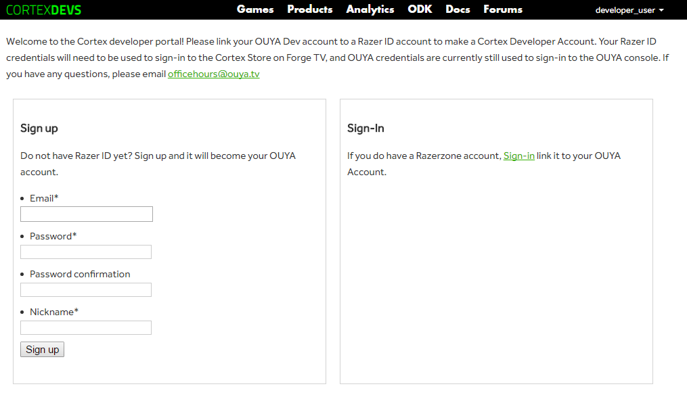
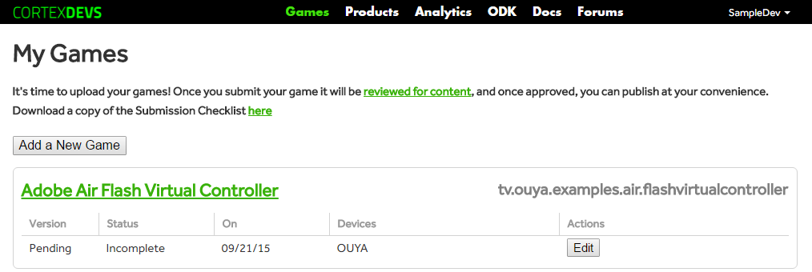
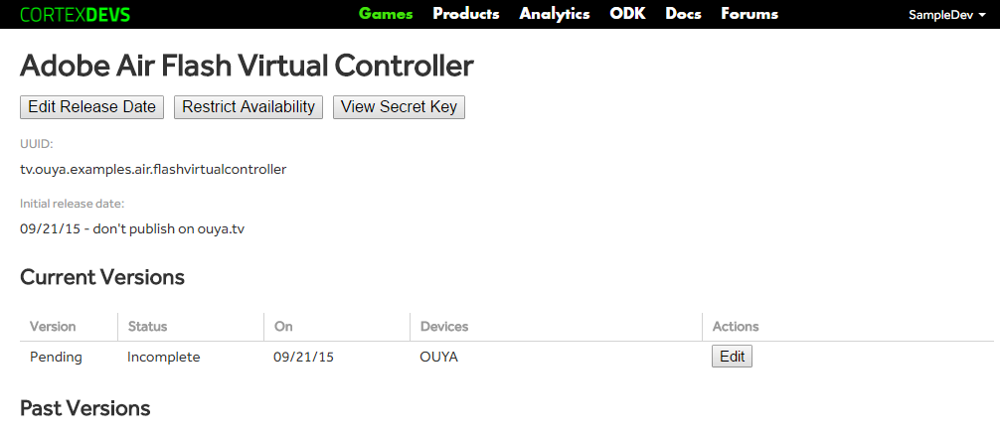
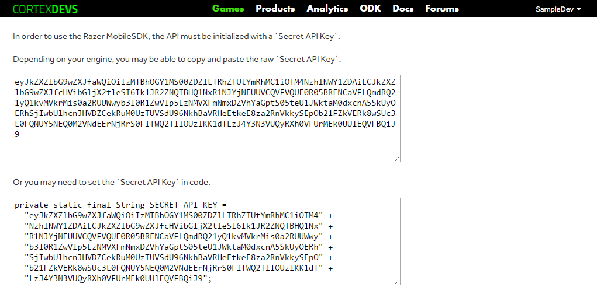
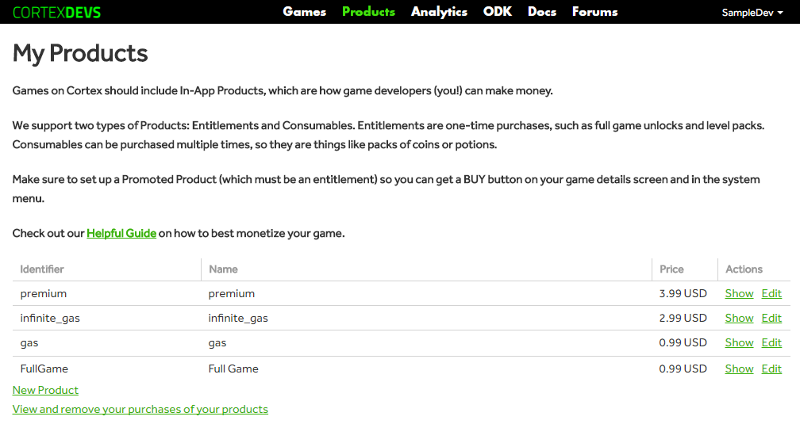

# Razer Store SDK

The latest version of this document can be found at [https://github.com/razerofficial/razer-sdk-docs](https://github.com/razerofficial/razer-sdk-docs).

The `Razer SDK` provides an `API` to integrate controller input, access gamer info, request product information, check receipts, and trigger in-app-purchases. Use the [developer portal](https://devs.ouya.tv) to create an account, setup your game, to setup purchases, to download the `Secret API Key` for your game, and to submit your game for review.

## Requirements

The [content-review-guidelines](https://github.com/ouya/docs/blob/razer-sdk/content-review-guidelines.md) provide a set of recommendations and requirements that are checked during review. Mobile games are required to support touch input. Adding controller support for mobile games is optional. The SDK supports controller input for users that pair bluetooth controllers with mobile devices. The review process requires that `SDK` initialization and shutdown code must be used which can be found in the engine documentation below.  

## Engines

The following engines have support for the `RazerSDK`. Be sure to let us know what engine you are using so we know what to target next.

### Adobe Air

`Adobe Air` is a `2D` engine. `Adobe Air` apps can be built from `Animate CC` or `Flash Develop`. Adobe recently renamed their `Flash` product as `Animate CC` part of the `Adobe Creative Cloud` suite. The `RazerSDK` can be accessed via the `RazerSDK Native Extension`. For details and samples visit [https://github.com/razerofficial/adobe-air-razer-sdk](https://github.com/razerofficial/adobe-air-razer-sdk).

### Cocos2d

`Cocos2d` is a `2D` and `3D` C++ engine. The `RazerSDK` can be accessed via the `RazerSDK Cocos2d Plugin`. For details and samples visit [https://github.com/razerofficial/cocos2d-plugin-razer-sdk](https://github.com/razerofficial/cocos2d-plugin-razer-sdk).

### Corona

`Corona` is a `2D` Lua engine. The `RazerSDK` can be accessed via the `RazerSDK Corona Plugin`. For details and samples visit [https://github.com/razerofficial/corona-plugin-razer-sdk](https://github.com/razerofficial/corona-plugin-razer-sdk).

### GameMaker

`GameMaker` is a `2D` engine. The `RazerSDK` can be accessed via a `GameMaker` extension. For details and samples visit [https://github.com/razerofficial/game-maker-razer-sdk](https://github.com/razerofficial/game-maker-razer-sdk).

### Java

`Java` is common language supported by most `Android` game engines. The `RazerSDK` can be accessed via an Android Library. For details and samples visit [https://github.com/razerofficial/java-razer-sdk](https://github.com/razerofficial/java-razer-sdk).

### Marmalade

`Marmalade` is a `2D` and `3D` C++ engine. The `RazerSDK` can be accessed via a `RazerSDK Marmalade` extension. For details and samples visit [https://github.com/razerofficial/marmalade-plugin-razer-sdk](https://github.com/razerofficial/marmalade-plugin-razer-sdk).

### Unity

`Unity` is a `2D` and `3D` engine. The `RazerSDK` can be accessed via the `RazerSDK Unity Plugin`. For details and samples visit [https://github.com/razerofficial/unity-plugin-razer-sdk](https://github.com/razerofficial/unity-plugin-razer-sdk).

### Unreal

`Unreal` is a `2D` and `3D` engine. The `RazerSDK` can be accessed via the `RazerSDK UE4 Plugin`. For details and samples visit [https://github.com/razerofficial/ue4-plugin-razer-sdk](https://github.com/razerofficial/ue4-plugin-razer-sdk).

# Getting Started

## Create an account

In order to access the `RazerSDK`, a developer account must be created via the [developer portal](https://devs.ouya.tv). Click the `Sign up` link on the landing page or log in with an existing account.

## Developer Email

Sign up requires an email account.

## Create Username

Choose your developer username and login credentials.

## Sign In

In order to submit games for review, the developer info must be completed. 

## Razer Account

After signing up or logging in, the developer portal will prompt to link your developer account with a `Razer ID`.

## Add a New Game

The `Games` section will display a list of games associated with the developer account. `Add a New Game` will prompt to create a game entry which requires a `package name` and `game title`. Click the game title to display the game entry details.

## Game Entry

The game entry details displays the `package name` which must match with the game `package name` from the `AndroidManifest.xml`. Each game has a unique `Secret API Key` used to authorize access to the `RazerSDK`. The `View Secret Key` button will display the `Secret API Key`. 

## View Secret Key

The `Secret Key Page` displays the `API Key` in common formats so that it can be copied for the particular game engine.

# Product Setup

The `Products` section of the [developer portal](https://devs.ouya.tv/developers/products) controls the setup process for premium purchases and in-app-purchases. The `New Product` link creates `Entitlements` and `Consumables`. `Entitlements` are one-time purchases and appear in the receipt results. `Consumables` can be purchased more than once and are used for things like in-game gems and game currency. `Consumables` do not appear in the receipt results. Both `Entitlements` and `Consumables` are assigned an `identifier` which is used by the `RazerSDK`. The `View and remove purchases of your products` link is useful for testing the purchase flow of your game. You will not be billed for purchasing your own game if you are logged into the device with the same developer account that the game entry was created in. The developer portal will show a purchase made on the same developer account which can be unset so that the purchase flow can be tested again. Removing a purchase will cause the `Entitlement` to no longer appear in the receipt results.  

